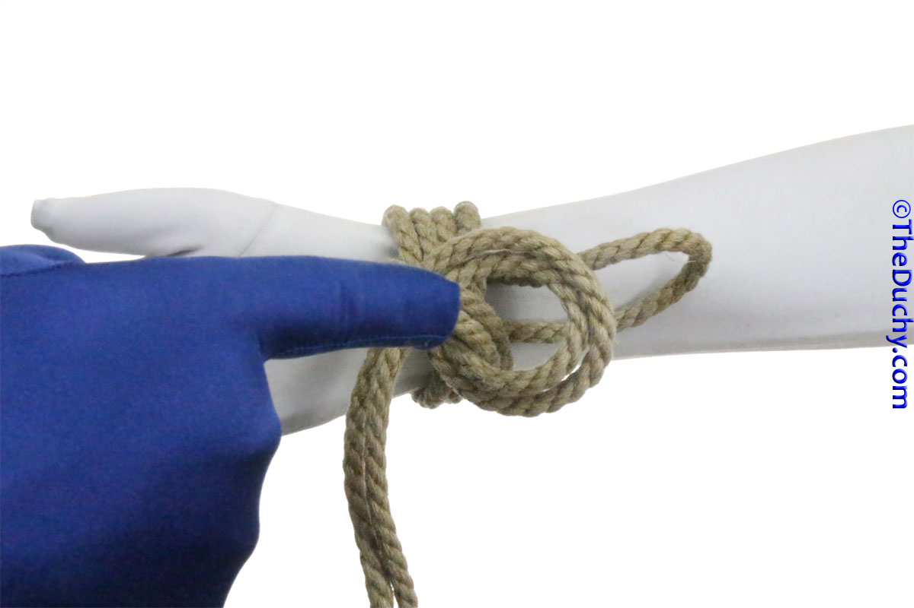

## [Somerville Bowline](https://www.theduchy.com/somerville-bowline/#core-technique-quick-overview)

        

1. Place the bight against the thing to be tied, leaving about 3-5 inches free 
2. Wrap the lead around 2 or 3 times  
3. Hold the bight away from the target and loop the tail around it. _Note that with this new loop you have formed a sort of cross_ 
4. Place the bight end across the top of this cross 
5. Reach under the cuff and grab the bight 
6. Pull the bight underneath the cuff 
7. Now run the bight through the loop by… 
8. …reaching through the loop, grabbing the bight… 
9. …and pulling it through. Tighten the knot first by tugging the bight, then… 
10. …by tugging the tail 
11. Once the knot is well formed, tighten more fully 
